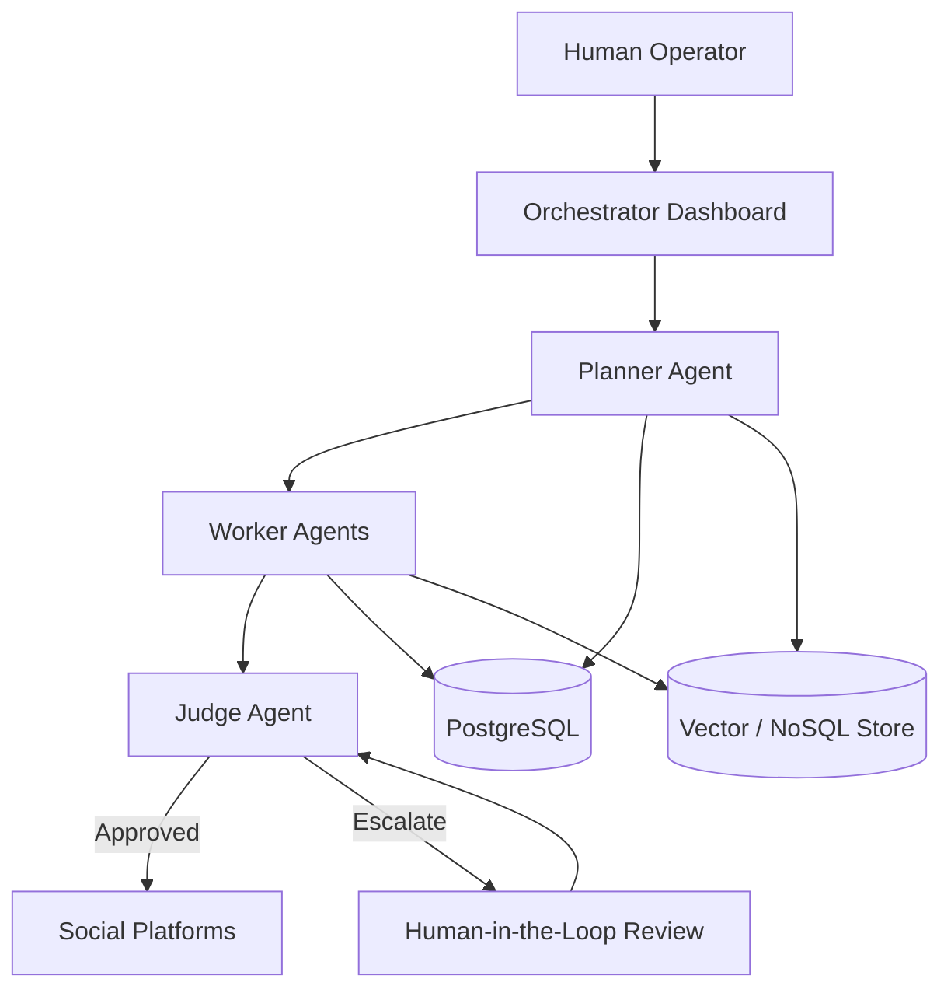

## Architecture Strategy — Project Chimera (Task 1.2)

### Purpose

This document outlines the high-level architectural decisions for Project Chimera before any implementation begins. The goal is to select agent patterns, governance points, and data storage strategies that support scalable autonomy while maintaining safety, clarity, and control.

---

## 1. Agent Pattern Selection

### Chosen Pattern: **Hierarchical Agent Model (Planner → Worker → Judge)**

Project Chimera will adopt a **hierarchical agent pattern**, where responsibility is explicitly separated across roles rather than relying on a single monolithic agent.

**Rationale:**

* Autonomous influencer behavior involves multiple distinct concerns: planning content strategy, executing content creation, and enforcing quality and safety.
* Separating these concerns reduces hallucination risk and makes agent behavior easier to reason about and govern.
* This structure aligns with lessons from large-scale agent experiments (e.g., OpenClaw ecosystems), where unstructured agent interaction led to unpredictable behavior.

**Role Overview:**

* **Planner Agent**: Interprets goals (campaigns, trends), decomposes them into concrete tasks, and schedules work.
* **Worker Agents**: Execute narrowly scoped tasks (trend fetching, caption generation, media preparation).
* **Judge Agent**: Reviews outputs for alignment with specs, safety constraints, and confidence thresholds before approval.

This pattern prioritizes **predictability and auditability** over raw creativity, which is essential for production-grade autonomous systems.

---

## 2. Human-in-the-Loop (HITL) Strategy

### Governance Model: **Approval by Exception**

Humans are not involved in every action. Instead, Project Chimera applies human oversight only when risk or uncertainty is detected.

**Human Review Triggers:**

* Low confidence scores from the Judge agent
* Sensitive content domains (politics, health, finance)
* High-impact actions (publishing, monetization-related actions)

**Flow:**

1. Worker generates content or action proposal
2. Judge evaluates confidence and safety
3. If confidence is high and no sensitivity is detected → auto-approve
4. If confidence is medium or sensitivity is detected → escalate to human reviewer
5. If confidence is low → reject and retry

This model balances **scalability** with **brand safety** and prevents full autonomy from becoming reckless.

---

## 3. Data Storage Strategy

### Structured Data: **SQL (PostgreSQL)**

PostgreSQL is the preferred choice for storing:

* Campaign configurations
* Agent metadata and identities
* Content schedules and publishing logs

**Reasons:**

* Strong consistency guarantees
* Clear relational structure
* Easier auditing and reporting

---

### High-Velocity / Unstructured Data: **NoSQL / Vector Storage**

For data that is dynamic or unstructured, a non-relational approach is preferred:

* Trend signals
* Engagement metrics
* Semantic memory for agents

This enables:

* Faster ingestion of high-volume signals
* Flexible schema evolution
* Efficient semantic search and retrieval

---

## 4. Safety, Identity, and Future-Proofing

Key architectural safeguards include:

* **Explicit agent identity** tied to persona definitions
* **Spec-driven constraints** that override free-form generation
* **Clear separation between agent skills and infrastructure tools**

By enforcing structure at the architectural level, Project Chimera avoids the uncontrolled emergent behavior observed in experimental agent social networks.

---

## 5. High-Level Architecture Diagram

This diagram illustrates the **hierarchical Planner–Worker–Judge flow** with human oversight applied only when necessary. All external actions (publishing, engagement) are gated by the Judge, ensuring safety and spec alignment.

---

## Summary Decision Snapshot

* **Agent Pattern**: Hierarchical (Planner / Worker / Judge)
* **Human Oversight**: Approval by exception (HITL)
* **Primary Database**: PostgreSQL (SQL)
* **High-Velocity / Semantic Data**: NoSQL / Vector storage

These decisions establish a stable foundation for scalable, governable autonomous influencer agents.
