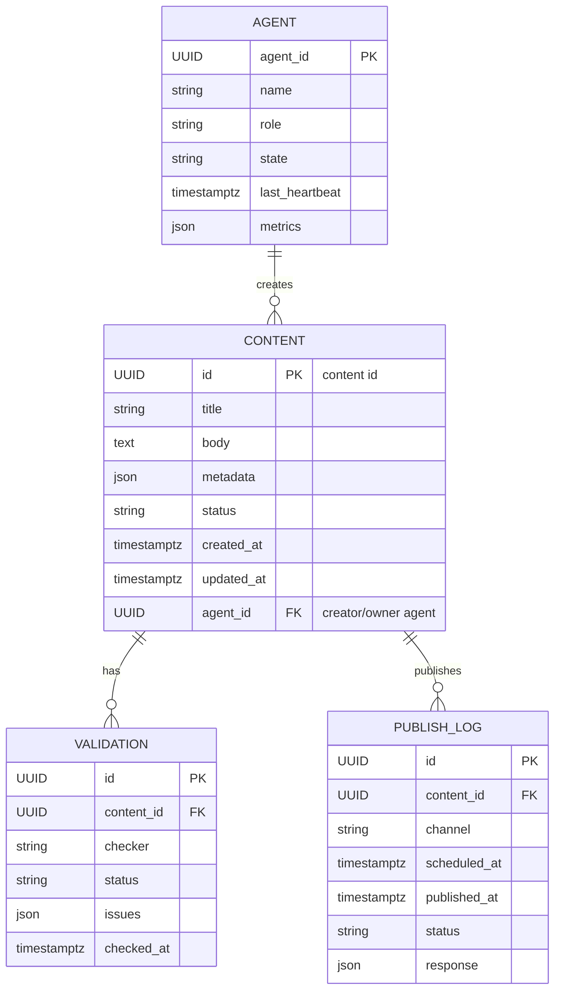

## ERD — Project Chimera (Mermaid)

Notes:
- `UUID` denotes a stable unique identifier (GUID/UUID).
- `json` fields are for extensible metadata and integration payloads.
- `status` fields should use a finite set of states (e.g., draft/pending/approved/published/rejected).
