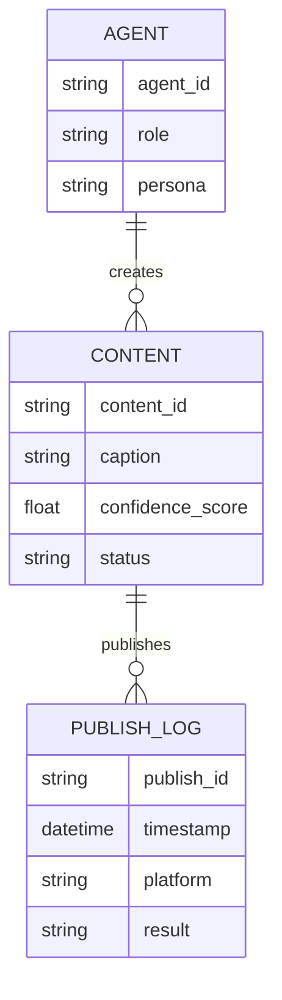

# Project Chimera — Technical Specification

## Agent API Contracts

### Generate Content — Request

```json
{
  "agent_id": "string",
  "persona": "string",
  "trend": {
    "topic": "string",
    "source": "string"
  }
}
```

### Generate Content — Response

```json
{
  "content_id": "string",
  "caption": "string",
  "confidence_score": 0.0,
  "flags": ["string"]
}
```

---

## Database Schema — Video Metadata



---

## Data Rules

* All content must have a confidence score
* Status transitions must be logged
* Publishing results must be auditable
