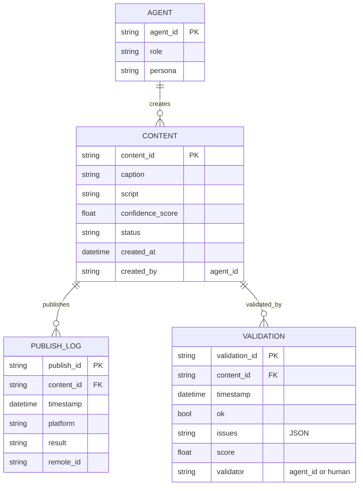

# Project Chimera — Technical Specification

## Agent API Contracts

This section defines the principal JSON input/output contracts used by agents and automation. Contracts are intentionally technology-agnostic and focus on the data exchanged across agent boundaries.

### fetch_trends(source: string) -> dict

Request:

```json
{ "source": "string", "limit": 20 }
```

Response (success):

```json
{
  "source": "string",
  "timestamp": "ISO-8601",
  "trends": [ { "name": "string", "score": 0.0 } ]
}
```

### generate_content(request: object) -> dict

Request:

```json
{
  "agent_id": "string",
  "persona": "string",
  "trend": { "name": "string", "source": "string" },
  "constraints": { "max_length": 280 }
}
```

Response (success):

```json
{
  "content_id": "string",
  "caption": "string",
  "script": "string",
  "confidence_score": 0.0,
  "flags": ["string"],
  "metadata": { "trend": { "name": "string", "source": "string" } }
}
```

### validate_content(content_id: string) -> dict

Response:

```json
{
  "content_id": "string",
  "ok": true,
  "issues": [],
  "score": 0.0
}
```

### publish_content(request: object) -> dict

Request/Response summary:

```json
{
  "content_id": "string",
  "platform": "string",
  "published_at": "ISO-8601",
  "publish_id": "string",
  "result": "string"
}
```

---

## Database Schema — Video & Audit Metadata

Mermaid ERD for the primary entities used to track content and publishing:



---

## Data Rules

- All `CONTENT` records must include a `confidence_score` and `created_by`.
- Every publish attempt must create a `PUBLISH_LOG` entry (success or failure).
- Every validation run must create a `VALIDATION` record linked to the `content_id`.

## Operational Notes

- Timestamps should be stored in UTC ISO-8601 format.
- Sensitive fields (access tokens, PII) must not be stored in `CONTENT` or logs without explicit redaction rules.

